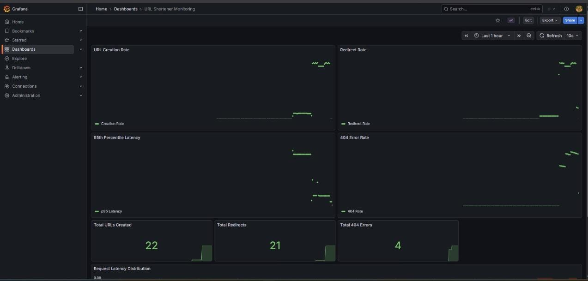
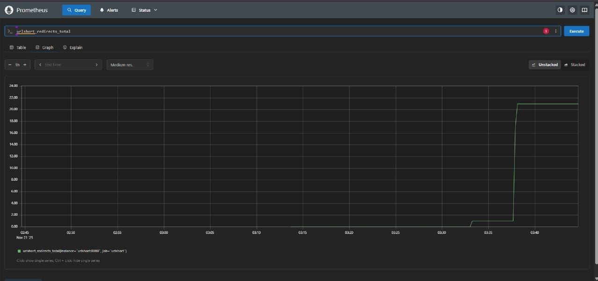
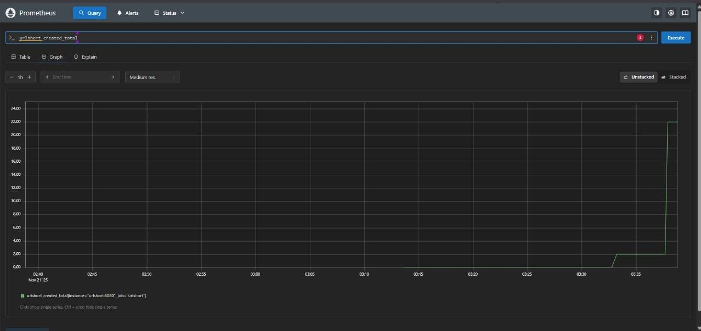
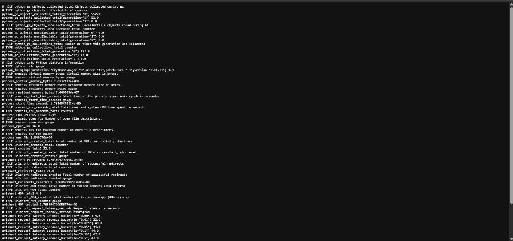
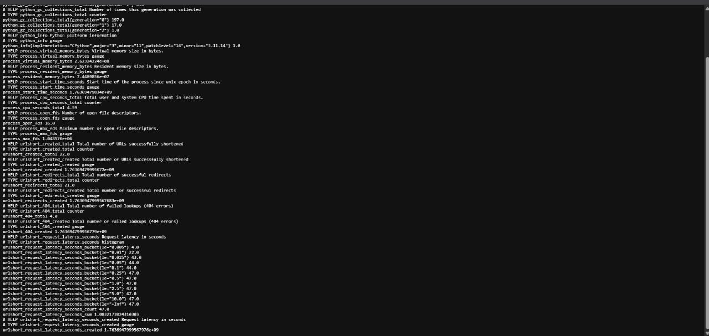
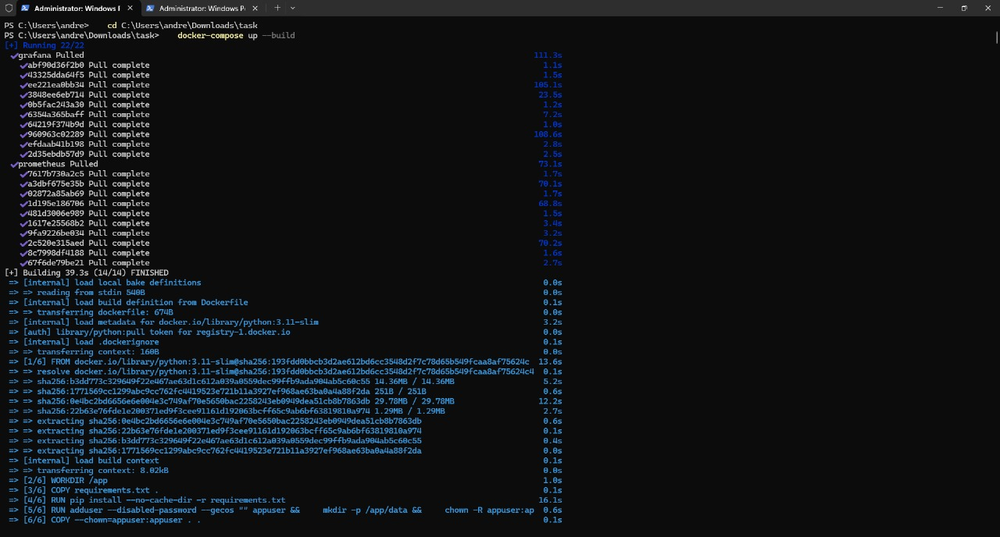
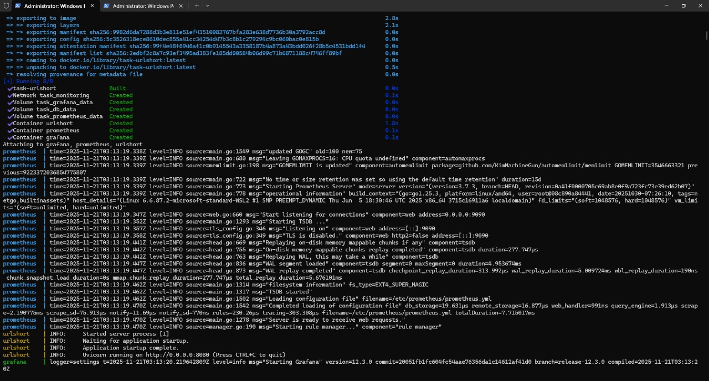
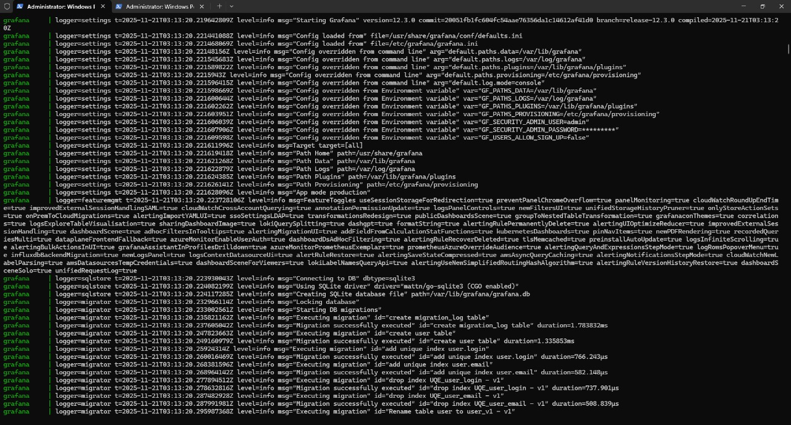
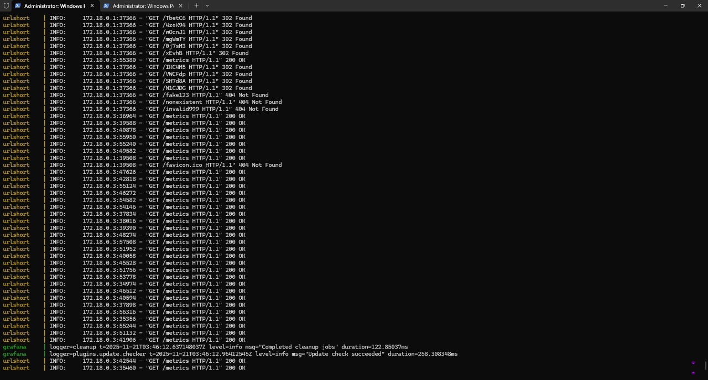

# Monitoring a Containerized URL Shortener Webservice

## Project Name

URL Shortener Monitoring

---

## Project Idea

Build, containerize, and monitor a functional URL shortener webservice. The full stack — application + monitoring (Prometheus, Grafana) — runs locally using Docker.

---

## Table of Contents

* [Project Overview](#project-overview)
* [Team Members (pentaRae)](#team-members-pentarae)
* [Instructor](#instructor)
* [Project Files](#project-files)
* [Screenshots](#screenshots)
* [Tech Stack](#tech-stack)
* [Architecture](#architecture)
* [Repository Layout](#repository-layout)
* [Work Plan](#work-plan)
* [Roles & Responsibilities](#roles-and-responsibilities)
* [KPIs (Key Performance Indicators)](#kpis-key-performance-indicators)
* [Getting Started (Quickstart)](#getting-started-quickstart)
* [Running Locally (development)](#running-locally-development)
* [Testing & Verification](#testing--verification)
* [Development Workflow & PR Checklist](#development-workflow--pr-checklist)
* [Roadmap & Next Steps](#roadmap--next-steps)
* [License](#license)

---

## Project Overview

This repository contains a containerized URL shortener service instrumented for monitoring. The service will:

* shorten long URLs,
* persist mappings,
* redirect short codes to long URLs,
* expose Prometheus-compatible metrics,
* be visualized and alerted on via Grafana.

---

## Team Members (pentaRae)

* mohamed yousery
* youssef abuzeid
* kirolos medhat
* dania momen
* andrew gamil

---

## Instructor

* IslamReda

---

## Project Files

You can find the full project files here:

<https://drive.google.com/drive/folders/1jR7lZjUpiV5e8a4LY72g0HVObMfwfbnY?usp=sharing>

---
## Screenshots

### Grafana Dashboard



### Prometheus Metrics
#### Prometheus Redirects Total

#### Prometheus Created Total


### Raw Metrics



### Service Running
#### Docker Compose




---
## Tech Stack

* Docker & Docker Compose
* Web framework: FastAPI (Python)
* Database: SQLite (local development)
* Monitoring: Prometheus
* Visualization & alerting: Grafana

---

## Architecture

All services run on a local Docker network and communicate over service hostnames.

```
+-----------+      +-------------+      +-----------+
| urlshort  | ---> | Prometheus  | ---> | Grafana   |
| (FastAPI) |      | (scrapes /metrics) | (dashboards)
+-----------+      +-------------+      +-----------+
      |
      v
   SQLite (named volume)
```

Prometheus scrapes the service at `http://urlshort:8080/metrics`.

---

## Repository Layout

```
DockGuard/
│
├── .github/
│   └── workflows/
│       └── ci.yml                    # CI/CD pipeline
│
├── db/
│   ├── backup.sh                     # Database backup script
│   ├── restore.sh                    # Database restore script
│   └── seed.sql                      # Sample seed data
│
├── docs/
│   ├── openapi.yaml                  # API documentation
│   └── runbook.md                    # Operations runbook
│
├── grafana/
│   └── provisioning/
│       ├── dashboards/
│       │   ├── dashboard.yml
│       │   └── urlshort-dashboard.json
│       └── datasources/
│           └── prometheus.yml
│
├── infra/
│   ├── generate_traffic.py           # Traffic generator
│   └── spinup-and-test.sh           # Integration tests
│
├── prometheus/
│   └── prometheus.yml                # Prometheus config
│
├── service/
│   ├── tests/
│   │   ├── __init__.py
│   │   └── test_main.py
│   ├── .dockerignore
│   ├── Dockerfile
│   ├── main.py                       # FastAPI app
│   ├── models.py                     # Database models
│   ├── requirements-test.txt
│   └── requirements.txt
│
├── .gitignore
├── docker-compose.yml                #  Main orchestration
├── GENERATE_TRAFFIC.ps1
├── QUICKSTART.md
├── README.md                         #  Main documentation
├── SETUP_INSTRUCTIONS.md
└── TEST_NOW.md
```

---

## Work Plan

1. Research & Analysis  
   * Audience personas
2. Visual Identity  
   * Logo design
3. Main Designs  
   * Poster
4. Complementary Products
5. Review & Finalization
6. Final Presentation

---

## Roles and Responsibilities

### Component Ownership (5 equal, independent tasks)

Each team member owns one independently testable component. Tasks are balanced so workload is roughly equal.

### 1 — Service Developer (Backend) — youssef abuzeid

**Deliverables**

* Service implementation with endpoints:  
   * `POST /shorten` → `{ "short_code": "abc123" }`  
   * `GET /{short_code}` → 302 redirect or 404  
   * `GET /metrics` → Prometheus exposition
* Unit tests, `Dockerfile`, `openapi.yaml`, `seed.sql` (sample data).**Branch**: `feature/service-<your-name>`

---

### 2 — Persistence & Database — youssef abuzeid

**Deliverables**

* DB schema & migrations
* `backup.sh` / `restore.sh`
* Docker volume mapping recommendations and `sample.db`
* DB helper module for service consumption**Branch**: `feature/db-<your-name>`

---

### 3 — Prometheus Integrator (Metrics) — andrew gamil

**Deliverables**

* `prometheus.yml` config to scrape `urlshort:8080`
* Instrumentation naming conventions:  
   * `urlshort_created_total`  
   * `urlshort_redirects_total`  
   * `urlshort_404_total`  
   * `urlshort_request_latency_seconds` (histogram)
* `verify_metrics.sh` and a mock exporter for parallel work**Branch**: `feature/prometheus-<your-name>`

---

### 4 — Grafana & Alerts (Dashboards) — andrew gamil

**Deliverables**

* Grafana provisioning + `dashboard.json` with panels:  
   * Creation rate, redirect rate, 95th percentile latency, 404 rate
* Alert rules for latency and error spikes
* `generate_traffic.py` to simulate load**Branch**: `feature/grafana-<your-name>`

---

### 5 — Orchestration, CI & Docs (Integration + QA) — andrew gamil

**Deliverables**

* `docker-compose.yml` wiring `urlshort`, `prometheus`, `grafana`, volumes
* `spinup-and-test.sh` integration test script
* CI pipeline (`.github/workflows/ci.yml`)
* Final `README.md`, runbook, PR templates**Branch**: `feature/integration-<your-name>`

---

## KPIs (Key Performance Indicators)

* Response time (p95, p99)
* System uptime / availability
* Requests per second (throughput)
* Error rate (4xx / 5xx, 404s)
* User adoption rate (number of shortened URLs / active users)

---

## Getting Started (Quickstart)


### Prerequisites

1. **Install Docker Desktop**

   - Download from: https://www.docker.com/products/docker-desktop/
   - Install and restart your computer
   - Make sure Docker Desktop is running (you'll see the Docker icon in your system tray)

2. **Verify Docker is installed**
   - Open PowerShell or Command Prompt
   - Run: `docker --version`
   - Run: `docker-compose --version`
   - Both commands should show version numbers

3. (Optional) Python 3.11+ for local development


### Quickstart

## Step 1: Open Terminal/PowerShell

   - Navigate to the project folder:
     ```powershell
     Ex: cd C:\Users\admin\Docs\project
     ```
## Step 2: Start All Services

```bash
docker-compose up --build
```

This will:
- Build the URL shortener service
- Start Prometheus
- Start Grafana
- Create necessary volumes

## Step 3: Verify Services

Wait about 10-15 seconds for services to start, then:

1. **Service API**: http://localhost:8080/metrics
2. **Prometheus**: http://localhost:9090
3. **Grafana**: http://localhost:3000 (login: admin/admin)


## Stop Services

```bash
docker-compose down
```

To also remove volumes:

```bash
docker-compose down -v
```

## Troubleshooting

### Port Already in Use

If ports 8080, 9090, or 3000 are in use, you can modify `docker-compose.yml` to use different ports.

### Services Not Starting

Check logs:
```bash
docker-compose logs urlshort
docker-compose logs prometheus
docker-compose logs grafana
```

### Database Issues

The database is stored in a Docker volume. To reset:
```bash
docker-compose down -v
docker-compose up --build
```


---

## Testing & Verification
# Test Your Running Project

## Your services are running! Here's how to test them:

### 1. Test URL Shortening

Open a **NEW PowerShell window** and run:

```powershell
# Create a short URL
curl -X POST http://localhost:8080/shorten -H "Content-Type: application/json" -d '{\"url\":\"https://example.com\"}'
```

You should get a response like:
```json
{"short_code":"abc123"}
```

### 2. Test the Redirect

Use the short_code from step 1:

```powershell
curl -I http://localhost:8080/YOUR_SHORT_CODE
```

Replace `YOUR_SHORT_CODE` with the code you got (e.g., `abc123`)

You should see: `HTTP/1.1 302 Found`

### 3. Check Metrics

Open in browser: http://localhost:8080/metrics

You should see Prometheus metrics including:
- `urlshort_created_total`
- `urlshort_redirects_total`
- `urlshort_404_total`
- `urlshort_request_latency_seconds`

### 4. View Prometheus

Open in browser: http://localhost:9090

- Click "Status" → "Targets" to see if urlshort is being scraped (should show UP)
- Go to "Graph" tab
- Try query: `urlshort_created_total`
- Click "Execute"

### 5. View Grafana Dashboard

Open in browser: http://localhost:3000

- Login with:
  - Username: `admin`
  - Password: `admin`
- Go to: **Dashboards** → **URL Shortener Monitoring**
- You should see graphs showing your metrics!

### 6. Generate Some Traffic

In PowerShell:

```powershell
cd C:\Users\andre\Downloads\task\infra
python generate_traffic.py 20 5
```

This will create 20 URLs and access them. Then watch the Grafana dashboard update in real-time!

---

## Keep Services Running

The services will keep running in your PowerShell window. You'll see logs scrolling.

**To stop services:**
- Press `Ctrl + C` in the PowerShell window where docker-compose is running

**To stop and remove everything:**
```powershell
docker-compose down
```

**To start again later:**
```powershell
docker-compose up
```

(No need for `--build` unless you changed code)

---

## Success Indicators

 All three containers are running
 Prometheus scraping metrics (you see GET /metrics requests)
 Grafana dashboard accessible
 Can create and redirect URLs
 Metrics visible in Prometheus
 Dashboard shows data in Grafana

**Your project is fully functional! **


---

## Development Workflow & PR Checklist

* Branching: `feature/<component>-<your-name>`
* PR must include:  
   * Build proof (`docker build` command output or CI run)  
   * Unit tests and results  
   * README updates for that component  
   * Integration smoke tests (curl commands) and expected output  
   * One other teammate assigned to review and sign off

---

## Roadmap & Next Steps

* MVP: Service + Prometheus + Grafana + dashboard + CI integration 
* Next: move from SQLite → Postgres (HA), add alert routing (Slack/Email), add auth for Grafana, run e2e load tests, add healthchecks and readiness probes.

---

## License

This project is licensed under the MIT License.

---

